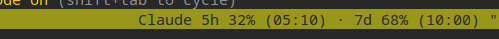

# tmux-claude-limit

Show your Claude Code account usage in the tmux status bar.



Reads the OAuth token Claude Code already stores at
`~/.claude/.credentials.json`, queries Anthropic's usage endpoint, and renders
your 5-hour, 7-day, and (optional) extra-credit utilization. Press `prefix + u`
for a popup with the full breakdown.

No login flow, no extra config files, no daemons. Just a bash script + a tiny
node http call, cached for `status-interval` seconds.

## Features

- 5-hour, 7-day, and extra-credit usage windows
- Color thresholds (low / mid / high) per bucket
- Reset times next to each bucket
- `prefix + u` popup with full breakdown and cache age
- Every visible element is gated behind a tmux option — toggle and restyle
  freely

## Requirements

- `tmux` 3.0 or newer
- `node` (just for one HTTPS call and JSON parsing — no `npm install`)
- A Claude Code login, i.e. `~/.claude/.credentials.json` exists

## Install

Pick whichever style fits your workflow.

### TPM

In `~/.tmux.conf`, above the `run '~/.tmux/plugins/tpm/tpm'` line:

```tmux
set -g @plugin 'aabolfazl/clux'
```

Then `prefix + I` to install. TPM uses the GitHub `user/repo` form.

### git clone (without TPM)

```bash
# tip of main
git clone https://github.com/aabolfazl/clux ~/.tmux/plugins/tmux-claude-limit

# or pin to v0.1
git clone --branch v0.1 https://github.com/aabolfazl/clux ~/.tmux/plugins/tmux-claude-limit
```

Then load it from `~/.tmux.conf`:

```tmux
run-shell '~/.tmux/plugins/tmux-claude-limit/claude-limit.tmux'
```

Reload: `tmux source-file ~/.tmux.conf`.

### Manual placement

Skip the loader and drop the segment into your existing `status-right` /
`status-left`:

```tmux
set -g status-right '#(~/.tmux/plugins/tmux-claude-limit/scripts/claude-limit status) | %H:%M %d-%b'
```

## Configuration

All options are tmux user options — set them before the loader runs.

| Option                                | Default       | Purpose                                                     |
| ------------------------------------- | ------------- | ----------------------------------------------------------- |
| `@claude_limit_position`              | `left-of-status-right` | Where the segment goes: `left-of-status-right`, `status-left`, `manual` |
| `@claude_limit_cache_ttl`             | `60`          | Seconds between live fetches (also drives `status-interval`) |
| `@claude_limit_min_status_right_length` | `200`       | Bumps `status-right-length` if it's smaller (tmux defaults to 40, which truncates) |
| `@claude_limit_show_five_hour`        | `on`          | Show the 5h bucket                                          |
| `@claude_limit_show_seven_day`        | `on`          | Show the 7d bucket                                          |
| `@claude_limit_show_extra`            | `on`          | Show the extra-credit `$xx% ($used/$limit)` piece           |
| `@claude_limit_show_reset`            | `on`          | Append `(HH:MM)` reset time to each bucket                  |
| `@claude_limit_show_stale`            | `on`          | Suffix ` ~` if the last fetch failed and we're rendering cache |
| `@claude_limit_label`                 | `Claude`      | Prefix label; set `''` to drop                              |
| `@claude_limit_separator`             | ` · `         | Between buckets                                             |
| `@claude_limit_time_format`           | `%H:%M`       | Reset-time format                                           |
| `@claude_limit_style_low`             | `fg=black`    | tmux style for usage below `threshold_mid`                  |
| `@claude_limit_style_mid`             | `fg=red,bold` | Style for usage at or above `threshold_mid`                 |
| `@claude_limit_style_high`            | `fg=brightred,bold,reverse` | Style for usage at or above `threshold_high`     |
| `@claude_limit_style_error`           | `fg=brightred,bold,reverse` | Style for unavailable / fetch-failed state       |
| `@claude_limit_threshold_mid`         | `70`          | Percent — switch to `style_mid` at/above                    |
| `@claude_limit_threshold_high`        | `90`          | Percent — switch to `style_high` at/above                   |
| `@claude_limit_popup_key`             | `u`           | Key bound to the popup (with `prefix`)                      |
| `@claude_limit_bind_popup`            | `on`          | Set `off` to skip the popup keybind                         |

### A note on colors

tmux's `bg=default` inherits the `status-style` background, not the terminal
background. So if your status bar has e.g. `bg=green` and you set
`fg=green`, you get green-on-green = invisible. Defaults pick foregrounds that
contrast on most themes (`fg=black` for low, `fg=red,bold` for warning,
`reverse` for danger), but if you have a dark status bar you'll likely want
something like:

```tmux
set -g @claude_limit_style_low  'fg=white'
set -g @claude_limit_style_mid  'fg=yellow,bold'
set -g @claude_limit_style_high 'fg=red,bold,reverse'
```

## Popup

`prefix + u` opens a small popup with all buckets, sub-buckets (sonnet/opus),
extra-credit details, and the local cache age. Disable with
`set -g @claude_limit_bind_popup 'off'` or rebind with
`set -g @claude_limit_popup_key 'L'`.

## Commands

The script is also useful on its own:

```bash
scripts/claude-limit status   # one-line tmux-formatted segment
scripts/claude-limit panel    # multi-line text breakdown (used in the popup)
scripts/claude-limit raw      # raw JSON from the cache
```

## Cache & env overrides

- Cache lives at `${XDG_CACHE_HOME:-~/.cache}/tmux-claude-limit/usage.json`,
  refreshed every `@claude_limit_cache_ttl` seconds.
- `CLAUDE_LIMIT_CREDENTIALS=/path/to/.credentials.json` — point at a
  non-default credentials file.
- `CLAUDE_LIMIT_USAGE_URL=...` — override the endpoint (testing).
- `CLAUDE_LIMIT_USER_AGENT=...` — override the User-Agent header.

## Security

The OAuth access token is read from `~/.claude/.credentials.json`, held only in
memory inside the `node` subprocess, and sent only as the `Authorization:
Bearer <token>` header to Anthropic's usage endpoint. It is never logged,
echoed to stdout, written to the cache, or passed as a CLI argument.

## Troubleshooting

**Segment is invisible.** Almost always a color collision — your
`status-style` has a background close to one of the plugin's defaults. Pick
contrasting colors per the *A note on colors* section above.

**Segment doesn't appear at all.** Check `tmux show-option -gqv
status-right-length`. tmux defaults to `40`, which truncates anything past 40
characters. The loader bumps this to 200, but a manual override can shadow it.

**Says `Claude: unavailable`.** Run `scripts/claude-limit raw` to see the
underlying error. Typical causes: stale OAuth token (open Claude Code and
re-auth), no network, or `node` not on tmux's `$PATH`.

**Wait, where's the data?** tmux only re-evaluates `#(...)` once per
`status-interval` (default 60s after install). Force a refresh with
`tmux refresh-client -S`, or briefly lower `status-interval`.

## License

MIT — see [LICENSE](LICENSE).
